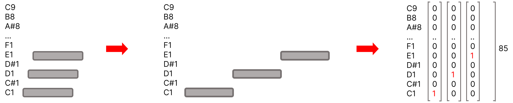
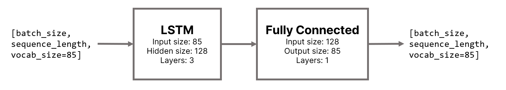
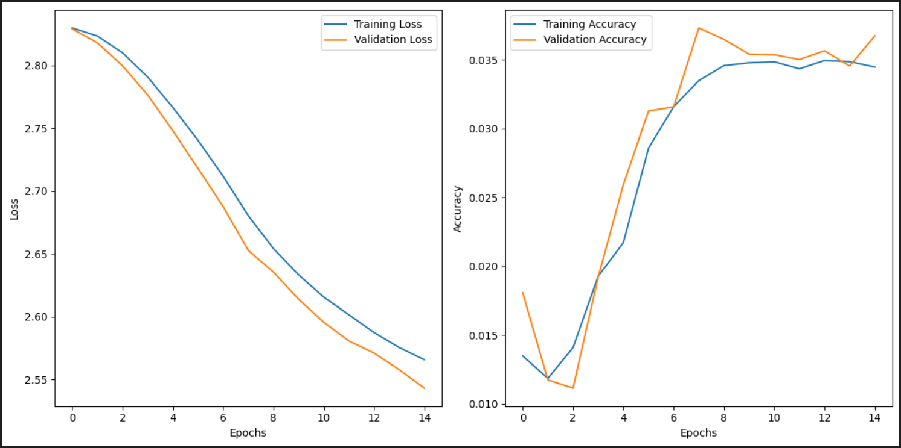
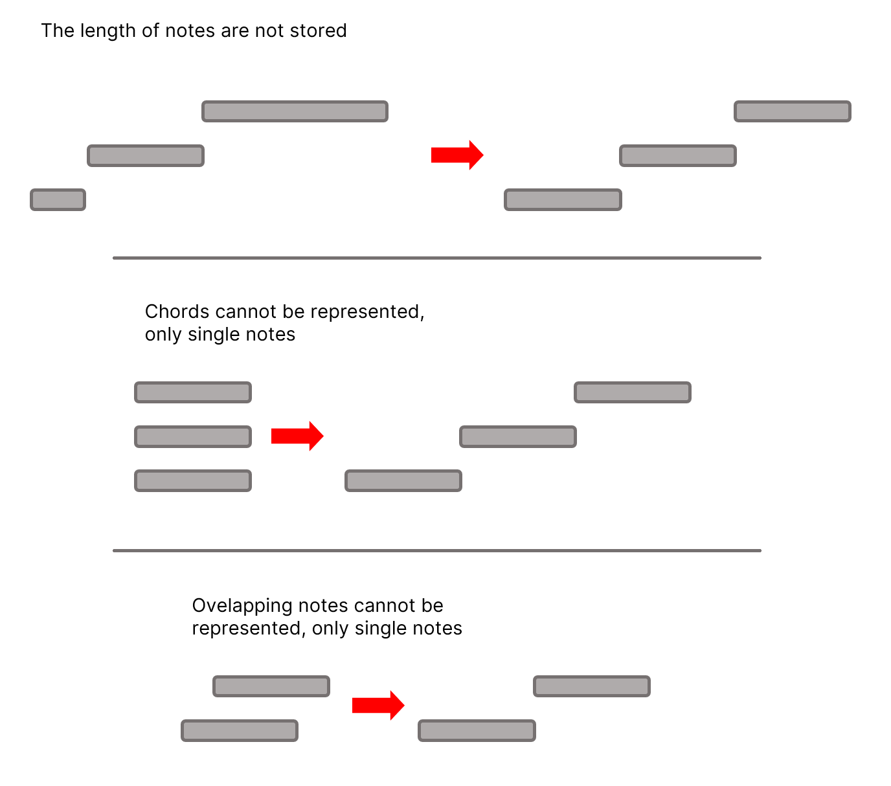
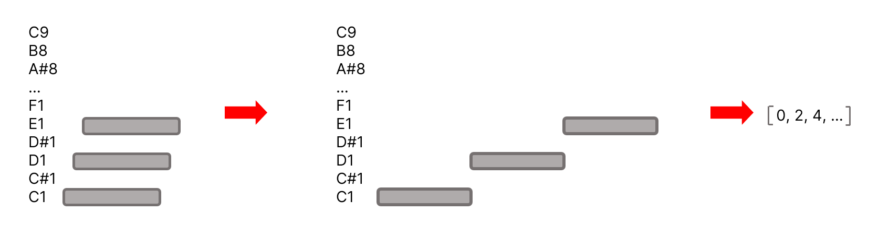
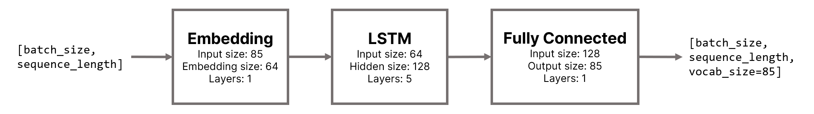
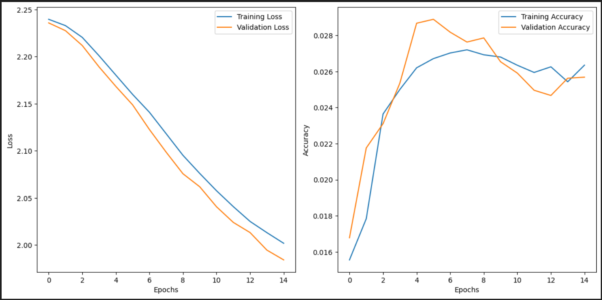

# MIDI generálás zongorához

Ebben a projektben 4 különböző reprezentációval és modellel próbáltam meg MIDI "kottát" generálni zongora hangszerhez. Az összes modellt én definiáltam, és tanítottam be szekvencia predikcióra klasszikus zongoraművek MIDI adatain. Eleinte egy nagyon primitív reprezentációval kezdtem, és az első 3 megközelítés alapvetően ugyanezzel az egyszerű reprezentációval dolgozik, csupán modellbeli különbségek vannak. A 4. megközelítés egy egészen más, sokkal komplexebb reprezentációt használ. Részletek lentebb olvashatók minden modellről.

## Mappastruktúra
```
├── data/                   # Adatbázis placeholdere, egyéb input MIDI-k, és ábrák a dokumentációhoz
├── generations/            # Generált MIDI file-ok placeholderei
├── src/                    # Utility scriptek
├── weights/                # Elmentett súlyok minden modellhez
├── model_n_train.ipynb     # Notebook betanításhoz minden modellhez (n = 1..4)
├── model_n_generate.ipynb  # Notebook generáláshoz minden modellhez (n = 1..4)
├── README_hu.md            # Projekt dokumentáció magyar nyelven
└── README.md               # Projekt dokumentáció angol nyelven
```

## Adatbázis
A betanításhoz minden modellnél a [GiantMIDI-Piano adatbázist](https://github.com/bytedance/GiantMIDI-Piano/tree/master) használtam. Ez egy klasszikus zongora MIDI adatbázis, amely 2786 előadó 10 855 művének MIDI fájljaiból áll. Az adatbázis mérete, és a modellek from-scratch betanítása miatt semmilyen adataugmentációt nem alkalmaztam a tanítások során.

## 1. Modell

### Reprezentáció

Az első próbálkozásnál egy egyszerű reprezentációt választottam, hogy kisebb modellekkel tudjak kísérletezni. Az alap ötlet az volt, hogy színtiszta szekvencia predikció legyen: csak hangok sorozatáról legyen szó, ne szólhasson több hang egyszerre (vagy egymásra "csúsztatva"), de még a hangok hossza se legyen számon tartva. Ehhez a reprezentációhoz egy 85 hangból álló "szótárat" készítettem, melyben C1 a legmélyebb, C9 a legmagasabb hang. Az adatbázis MIDI fájljain végigiterálva az egyes hangokon eltároltam azokat (eldobva a hosszukat), majd ezeket (85 hosszú) one-hot vektorokká alakítottam. A reprezentáció természetesen elég nagy adatvesztéssel járt, viszont biztosította, hogy csak a legszükségesebb adatokkal kelljen dolgoznia a modellnek.



### Modell architektúra

Az első modell nyersen a one-hot vektorok sorozatát kapja inputként, melyet 3 réteg LSTM sejt követ. Az utolsó LSTM réteg rejtett rétegének kimenetét egy teljesen összekötött réteg dolgozza fel, ami egy bemenettel azonos formátumú kimenetet generál.



**Megjegyzés:** a betanítások során több beállítással is próbálkoztam, így az elmentett modellek bizonyos attribútumai nem feltétlenül egyeznek az ábrán látottakkal. A [weights/model_1](weights/model_1/) mappában található elmentett modellek az alábbi logika alapján vannak elnevezve: `YYYY-MM-DD_hh-mm-ss_h[LSTM_hidden_layer_size]_l[LSTM_layers_number]_sl[sequence_length]`.

### Eredmények

Az egyszerű reprezentáció ellenére a modell meglepően jól teljesített az egyszerű motívumok megtanulásában. A kezdő dallamokat jól folytatja, és alapvető fel-le lépkedéseket fel lehet ismerni a generált sorozatokban. Példákat a [generations/model_1](generations/model_1/) mappában lehet találni.



*Grafikonok a költség és pontosság alakulásáról a modell 15 epoch-os betanításánál.*

### Kihívások, hátrányok

A megközelítés legnagyobb hátránya egyértelműen a reprezentációban rejlik: ellehetetleníti az egymásra csúszó hangok, az akkordok, és még a különböző hosszúságú hangok ábrázolását is. Az akkordok egyéni hangokra bontása valószínűleg rengeteg zajt vezet be a tanítóadatokba, (szerintem) ezért a generált sorozatok gyakran tartalmaznak kiugró hangokat (nagyon mély vagy nagyon magas), amelyek kevésbé illenek a dallamba.



Egy másik jelentős probléma az adatfeldolgozás erőforrásigénye. Az adatbázis MIDI fájljainak feldolgozása rendkívül időigényes, minden egyes adatbáziselem lekérésekor be kell olvasni a fájlt, majd one-hot vektorok sorozatává alakítani. Az adatbázis egyszeri előfeldolgozását pedig megakadályozza, hogy a one-hot vektoros ábrázolás megsokszorozza az adatbázis méretét, így nem fért el egyszerre a számomra rendelkezésre álló memóriaterületen.

## 2. Modell

### Reprezentáció
A reprezentáció majdnem teljesen megegyezik az első modellben látottakkal. Az egyetlen különbség az, hogy a one-hot vektorok helyett, most csak a hangok indexét tároljuk el (C1 = 0, C9 = 84), ezáltal a sorozatok sokkal kisebb helyet foglalnak, egy kevésbé memóriaigényes adatfeldolgozást eredményezve.



### Modell architektúra

Az második modell a hangok indexének sorozatát kapja inputként, melyet először egy embedding réteg dolgozza fel, és alakítja a 0-85 közötti indexet egy 64 hosszú vektorrá. Ezt utána 5 réteg LSTM sejt követi. Az utolsó LSTM réteg rejtett rétegének kimenetét egy teljesen összekötött réteg dolgozza fel, ami végül 85 hosszú valószínűségi vektorokat generál (tehát a kimenet egyezik az első modellel).



**Megjegyzés:** a betanítások során több beállítással is próbálkoztam, így az elmentett modellek bizonyos attribútumai nem feltétlenül egyeznek az ábrán látottakkal. A [weights/model_2](weights/model_2/) mappában található elmentett modellek az alábbi logika alapján vannak elnevezve: `YYYY-MM-DD_hh-mm-ss_e[embedding_dimension]_h[LSTM_hidden_layer_size]_l[LSTM_layers_number]_sl[sequence_length]`.

### Eredmények

Ugyan az előfeldolgozás költsége csökkent, az eredmény nem változott jelentősen. Bizonytalanul ugyan, de talán kicsit konzisztensebbnek mondanám az egyszerű motívumok megjelenését (az első modellhez képest), de egyértelmű metrika hiányában ez lehet csak a személyes véleményem.



*Grafikonok a költség és pontosság alakulásáról a modell 15 epoch-os betanításánál.*

### Kihívások, hátrányok

A hátrányok alapvetően itt is az előfeldolgozás adatvesztésében rejlenek (lásd részletesebben az [1. Modell - Kihívások, hátrányok](#kihívások-hátrányok-1) részt).

## 3. Modell

### Reprezentáció

### Modell architektúra

### Eredmények

### Kihívások, hátrányok

## 4. Modell

### Reprezentáció

### Modell architektúra

### Eredmények

### Kihívások, hátrányok